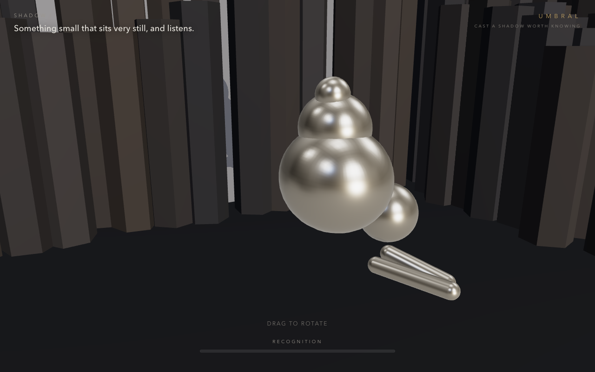

# Umbral

A shadow-projection puzzle game in the spirit of *Shadowmatic*. An abstract,
metallic form floats in mid-air inside a field of columnar basalt. A light casts
its shadow onto the wall behind it. **Rotate the form** until its shadow resolves
into a recognizable silhouette — an animal, a tool — and the level is solved.



## Run it

```bash
npm install
npm run dev      # opens http://localhost:5173
```

```bash
npm run build    # production bundle in dist/
npm run preview  # serve the production build
```

Append `?debug` to the URL to see the live silhouette mask, the target mask, and
the current IoU score — handy for authoring new shapes.

## How it works

- **Rotate the object, not the camera.** Drag to tumble the floating form
  (`src/controls/Arcball.js`). The light and camera stay fixed.
- **Silhouette matching (`src/puzzle/Matcher.js`).** An orthographic camera at the
  light renders *only* the object as a flat white-on-black mask into a small
  (128×128) offscreen target. It compares this against the mask captured at the
  solution pose using **Intersection-over-Union (IoU)**. A Schmitt-trigger
  (hold above ~0.9 for 350 ms) fires the win; the same score drives the
  recognition meter. Sampling is throttled to ~10 Hz and idle-gated.
- **Solution = identity, by construction.** Each object is authored in the XY
  plane (the shadow plane) with pieces pushed to varied Z depths. Head-on they
  tile into one clean silhouette; from any other angle the depth spread reads as
  a chaotic metal cluster. So the solved orientation is simply zero rotation —
  no search needed. See `src/puzzle/levels.js` and `src/puzzle/ObjectBuilder.js`.
- **One light, two consumers.** `src/core/LightRig.js` is the single source of
  truth for the light direction and frustum, shared by the *visible* shadow and
  the *matcher*, so they can never drift.
- **Basalt environment (`src/env/Basalt.js`).** Hundreds of hexagonal stone
  columns with noise-driven heights, drawn as a single `InstancedMesh`.

## Adding a level

Add an entry to `LEVELS` in `src/puzzle/levels.js`:

```js
{
  name: 'Bird',
  hint: 'It belongs to the sky.',
  solveThreshold: 0.86,
  startQuat: quat(0.7, 1.8, 0.4),   // scrambled starting orientation
  pieces: [
    { type: 'capsule', args: [0.16, 1.2], pos: [0, 1.2, 0] },
    // ...author the silhouette in the XY plane, scatter pieces in Z
  ],
}
```

Author the shape so its pieces overlap into a contiguous silhouette at identity,
and give it an asymmetric feature so a 180° flip can't false-match. Use `?debug`
to check the captured target mask.
